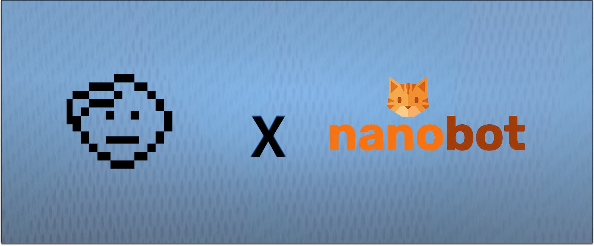

<div align="center">
  
  <h3>nanobot + Honcho: Long-Term Memory for Your AI Assistant</h3>
  <p>
    A fork of <a href="https://github.com/HKUDS/nanobot">HKUDS/nanobot</a> with <a href="https://honcho.dev">Honcho</a> AI-native memory built in.
  </p>
  <p>
    
    
    <a href="https://honcho.dev"></a>
  </p>
</div>

---

nanobot is an ultra-lightweight personal AI assistant (~4,000 lines of core code). This fork adds **Honcho** for persistent, cross-session user memory — your bot remembers who you are, what you care about, and what you've talked about, without you having to repeat yourself.

## What Honcho Adds

- **Cross-session memory** — context carries over between conversations automatically
- **User modeling** — builds a representation of the user over time (preferences, history, patterns)
- **Prefetch context** — relevant user context is injected into the system prompt before each LLM call
- **Session rotation** — `/clear` or `/new` starts a fresh conversation while preserving long-term memory
- **Automatic migration** — existing local sessions and memory files migrate to Honcho on first use

Honcho is **enabled by default** on this fork. The bot works without it (graceful degradation), but memory won't persist across sessions.

## Quick Start

```bash
git clone https://github.com/plastic-labs/nanobot-honcho.git
cd nanobot-honcho
pip install -e ".[honcho]"
nanobot onboard
```

### Configure

Add your LLM provider key and Honcho key to `~/.nanobot/config.json`:

```json
{
  "providers": {
    "openrouter": {
      "apiKey": "sk-or-v1-..."
    }
  }
}
```

Set up Honcho (free key from [app.honcho.dev](https://app.honcho.dev)):

```bash
nanobot honcho enable --api-key YOUR_HONCHO_KEY
```

### Chat

```bash
nanobot agent                    # interactive mode
nanobot agent -m "Hello!"       # single message
nanobot gateway                  # start gateway (Telegram, Discord, etc.)
```

### Slash Commands

| Command | Description |
|---------|-------------|
| `/new` | Start a new conversation (consolidates memory) |
| `/clear` | Clear session and start fresh (rotates Honcho session) |
| `/help` | Show available commands |

## Configuration

Config file: `~/.nanobot/config.json`

### Honcho

| Field | Default | Description |
|-------|---------|-------------|
| `honcho.enabled` | `true` | Enable Honcho memory integration |
| `honcho.workspaceId` | `"nanobot"` | Honcho workspace identifier |
| `honcho.prefetch` | `true` | Inject user context into system prompt |
| `honcho.environment` | `"production"` | Honcho environment |

### Honcho CLI

```bash
nanobot honcho enable --api-key KEY   # Enable + save API key
nanobot honcho enable --migrate       # Migrate local sessions to Honcho
nanobot honcho disable                # Revert to local file-based sessions
nanobot status                        # Check Honcho connection status
```

### Providers

This fork supports all upstream providers. See the [upstream README](https://github.com/HKUDS/nanobot#providers) for the full list:

OpenRouter, Anthropic, OpenAI, DeepSeek, Groq, Gemini, MiniMax, AiHubMix, DashScope, Moonshot, Zhipu, vLLM, OpenAI Codex (OAuth), and any OpenAI-compatible endpoint.

### Channels

All upstream channels are supported. See [upstream docs](https://github.com/HKUDS/nanobot#-chat-apps) for setup:

Telegram, Discord, WhatsApp, Feishu, Mochat, DingTalk, Slack, Email, QQ.

### MCP

nanobot supports [MCP](https://modelcontextprotocol.io/) for external tool servers. Config format is compatible with Claude Desktop / Cursor. See [upstream docs](https://github.com/HKUDS/nanobot#mcp-model-context-protocol).

## How It Works

```
User message
    |
    v
[Honcho prefetch] -- retrieve user context from memory
    |
    v
[System prompt + user context + conversation history]
    |
    v
[LLM generates response]
    |
    v
[Honcho sync] -- save exchange to persistent memory
    |
    v
Response to user
```

On first message per session, local JSONL history and `MEMORY.md`/`HISTORY.md` files are automatically migrated to Honcho. After migration, Honcho is the single source of truth for conversation persistence.

## Upstream

This fork tracks [HKUDS/nanobot](https://github.com/HKUDS/nanobot) and merges upstream regularly. The Honcho integration is maintained as an additive layer — all upstream features (MCP, providers, channels, skills, cron, heartbeat) work as documented.

To contribute Honcho-specific changes, open a PR against this repo. For general nanobot improvements, consider contributing upstream.

## License

MIT — same as upstream.
